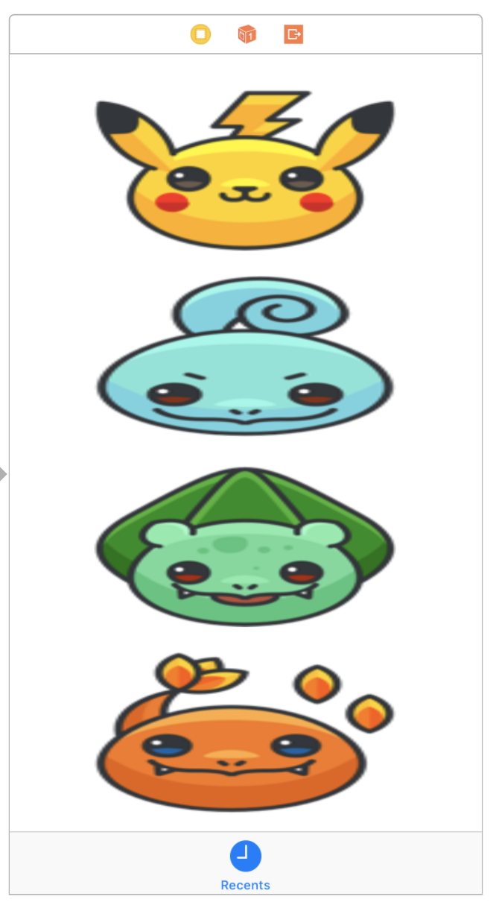
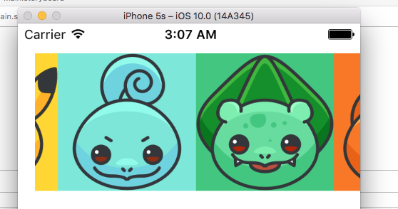

# AC3.2 Stackview and Scrollview: Part II

---
### Readings

1. [`UIStackView` - Apple](https://developer.apple.com/reference/uikit/uistackview)
2. [AutoLayout Guide: Stack Views - Apple](https://developer.apple.com/library/content/documentation/UserExperience/Conceptual/AutolayoutPG/LayoutUsingStackViews.html)
3. [Into to Stack Views in iOS 9 - App Coda](http://www.appcoda.com/stack-views-intro/)
4. [UIStackView by Example - Hacking With Swift](https://www.hackingwithswift.com/read/31/2/uistackview-by-example)
5. [Views with Intrinsic Content Size - Apple](https://developer.apple.com/library/content/documentation/UserExperience/Conceptual/AutolayoutPG/ViewswithIntrinsicContentSize.html)

#### References

1. [`UIViewContentMode` - Apple](https://developer.apple.com/documentation/uikit/uiviewcontentmode)

---
### Vocabulary

1. **Adaptive Design**: having your app resize its UI and content such that it looks good on any sized screen ([Apple](https://developer.apple.com/design/adaptivity/))
2. **Aspect Ratio**:  The proportional relationship between its width and its height. It is commonly expressed as two numbers separated by a colon, as in 16:9. ([Wiki](https://en.wikipedia.org/wiki/Aspect_ratio_(image))
3. **Intrinsic Content Size**: ([Apple](https://developer.apple.com/library/content/documentation/UserExperience/Conceptual/AutolayoutPG/ViewswithIntrinsicContentSize.html))

---
### 0. Objectives

1. Exploring the `UIStackView` UI element for quickly aligning rows and/or columns of known content
2. Further reinforcing the use of `UIScrollView` to display large amounts of content in a limited space
3. Practicing layout with a storyboard

---
### 1. Intro

Hopefully, the [previous lesson exercises](https://github.com/C4Q/AC3.2-Stackview_Scrollview-1#exercises-️️-️️) have shown you that it isn't an entirely trivial task to work with scroll views. And yet, they're everywhere. A lot of this effort needed is mitigated by using `UITableView` and `UICollectionView` to neatly arrange elements, but sometimes it doesn't make sense to implement either of those for very simple setups that require some degree of dynamic sizing and updating.

That's one of the reasons Apple introduced the `UIStackView`: to streamline the vertical and horizontal layouts of a known number of views. It handles a good portion of autolayout for you, which allows you to create a UI that adapts to screen size and layout changes much more easily than if you were coding a `UIScrollView`. Note however, `UIStackView` doesn't handle all of the autolayout which is why it's still critical knowledge (and when we get into programmatic autolayout later in the course, this will be even further emphasized). A deep understanding of autolayout and stack views will allow you to create some pretty impressive and responsive designs without *much* work.

Let's start simple though: We're going to take a basic look at a stack view to create a horizontally scrolling row of Pokémon icons.

---
### 2. PokéStack

Today's lesson is going to focus on implementing a simple, horizontally scrolling stack view. We're going to take a look at how to embed elements into a stack view, along with some of the options we have for configuring how elements will be laid out once they are embedded in the stack view.

1. Drag in a new `UIViewController` into `Main.storyboard` and set it to be the initial view controller
2. With the view controller selected, go into `Editor > Embed In > Tab Bar`
3. Drag in four `UIImageView` and set their images to the four starter Pokémon. For the unfamiliar, they are: `Pikachu, Squirtle, Bulbasaur` and `Charmander`.
4. By default, images added will have their `contentMode` set to `Aspect Fill`. `Aspect Fill` will attempt to fill the bounds of the view while preserving the aspect ratio of the content. Two other common options are `scale fill` which will attempt to fill the bounds of the view stretching content if needed, and `aspect fit` which will size the content to fit within the bounds of the view while preserving aspect ratio. See the table below for further explanation (and feel free to play around with the other content modes to get a sense for each of them):

<table>
	<thead>
		<tr>
			<td>Image Views</td>
			<td>Scale Fill</td>
			<td>Aspect Fill</td>
			<td>Aspect Fit</td>
		</tr>
	</thead>
	<tbody>
		<tr>
			<td width="200"></td>
			<td width="200"></td>
			<td width="200"></td>
			<td width="200"></td>
		</tr>
		<tr>
			<td>Default image views in Interface Builder</td>
			<td><em>Scale to Fill:</em> Tries to fill the bounds of the view, stretching content if necessary.</td>
			<td><em>Aspect Fill:</em> Tries to fill the bounds of the view based on the larger dimension (width or height). Keeps aspect ratio of the content.</td>
			<td><em>Aspect Fit:</em> Fits the content to within the bounds of the view, preserving aspect ratio.</td>
		</tr>
	</tbody>
</table>

5. When dealing with images, we're usually most concerned about preserving aspect ratio (so that the image doesn't appear distorted). Change the image content mode to `Aspect Fit`. Also, set the background color of the image views so that we can better see the bounds of the view.

<table>
	<thead>
		<tr>
			<td>Aspect Fit, Bkdg Color</td>
			<td>Util Panel, Content Mode</td>
		</tr>
	</thead>
	<tbody>
		<tr>
			<td></td>
			<td></td>
		</tr>
	</tbody>
</table>

6. Now that we have the four imageviews set up we can add them to a stack view. There are a couples of ways to add a stack view in storyboard:
	- You can drag in either a `Horizontal Stack View` or `Vertical Stack View` from the Object Library in the right pane
	- You can select the views you'd like to place in a stack view, and then go to `Editor > Embed In > Stack View`
	- Or, you can select the views and click on the `Stack` button, conveniently located next to the `Align`, `Pin` and `Resolve AutoLayout Issues` buttons on the bottom right corner of Interface Builder.
	- 
7. There are three main configuration options needed to consider for a stack view (see `UIStackView` documentation under ["Managing the Stack View's Apperance"](https://developer.apple.com/documentation/uikit/uistackview))
	- `Axis` - the orientation of the stack, `vertical` or `horizontal`
	- `Alignment` - the layout of the arranged views *perpendicular* to the stack’s axis
	- `Distribution` - the layout of the arranged views *along* the stack’s axis

> Developer's Note: Once again, it's encouraged that you try out variations of each of these properties to get a sense for what each is accomplishing. Visual changes made by each of these properties is best understood having used them for a while.

You may have already noticed how each of these options affects the contents of the stack view.

<table>
<thead>
	<tr>
	<td> </td>
	<td>Vertical Align Center</td>
	<td>Horizontal Dist. Fill</td>
	</tr>
</thead>
<tbody>
	<tr>
	<td>
	Though one thing you might not immediately realize is that the four icons have a maximum height and width of <code>128pt</code>. But each one has a <code>width</code> or <code>height</code> slightly smaller than <code>128pt</code>. For example, the image of Squirtle is slightly narrower than the other icons. You can observe this by switching the <code>alignment</code> of the stack view to be <code>center</code> instead of <code>fill</code>.
	 
	Alternatively, you could switch <code>axis</code> to <code>horizontal</code> and set <code>distribution</code> to <code>fill</code>
	</td>
	<td width="250"></td>
	<td width="250"></td>
	</tr>
</tbody>
</table>

<table>
<tbody>
<tr>
	<td>Using the slight differences in the width and height of the images, these icons are a good way to visually identify how the options of a stack view affects its content. Now, let's make our images look uniform in size by using:
		<ul>
		<li><code>Axis</code> = <code>Horizontal</code></li>
		<li><code>Alignment</code> = <code>Fill</code></li>
		<li><code>Distribution</code> = <code>Fill Equally</code></li>
		</ul>
	</td>
	<td width="500"></td>
</tr>
</tbody>
</table>

8. Lastly, pin the stackview to the top-left of the screen with the following constraints:
	- `8pt` `left` and `top` relative to margins
9. Run the project... Ah.. bummer. I guess we'll need a scroll view
	- 
10. Selecting the stack view, go to `Editor > Embed In > Scroll View`
11. For the scroll view, you'll need the following constraints:
	- Pin to `top`, `left` and `right` edges of its super view
12. For the stack view:
	- remove the two constraints we just set on the stack view (`left` and `top` pins)
	- Add `8pt top, left, right, bottom`, relative to margins
	- And add `Center Vertically In Container`
13. Run the project.

What's nice about using the image views (along with the stack view) is that they define their own intrinsic content size. So we have far fewer constraints needed to satisfy autolayout.

<table>
	<tbody>
		<tr>
			<td width="350"></td>
			<td width="350"></td>
		</tr>
	</tbody>
</table>
<table>
	<tbody>
		<tr>
			<td width="700"></td>
		</tr>
	</tbody>
</table>

---
### 3. Exercises

> Note: There are no tests for these exercises
> Note: Please use the existing project for these exercises; add new `UIViewController` to the storyboard and link them to the existing `UITabBarController`

1. Continue on and create 2 more horizontally scrolling stack views using the other two pokemon asset categories in `Assets.xcassets` ("Common Pokemon" and "Uncommon Pokemon")
	- Add a label just above each stack view with that group's category ("Starter Pokemon", "Common Pokemon", Uncommon Pokemon")
	- Select the 3 stack views and 3 labels and embed them in a `vertical` stack view
	- Now, with that vertical stack view selected, embed everything in a vertical-only scroll view.

Here's what your finished product should look like:

<table>
	<thead>
		<tr>
			<td>Exercise 1: Running in Sim</td>
			<td>Execise 1: Expanded View</td>
		</tr>
	</thead>
	<tbody>
		<tr>
			<td width="300"></td>
			<td width="500" ></td>
		</tr>
	</tbody>
</table>

---

2. Create two vertical stack views **each embedded in their own** vertically-scrolling, scroll view.
	- Each scroll view should be 1/2 the width of the screen, and have its edges pinned to the edges of the view and each other (trailing edge of scroll view 1 is pinned to leading edge of scroll view 2)
	- Add at least 6 `UIImageView` or `UIView` to each stack view to ensure you are able to demonstrate some scrolling
	- Make sure that the images are all the same dimensions, aligned properly, and set to `aspect fit`. They should all be equally distant from each other as well.

When complete, you should have something similar to:

<table>
	<thead>
		<tr>
			<td>Exercise 2 - Sim</td>
			<td>Exercise 2 - Expanded</td>
		</tr>
	</thead>
	<tbody>
		<tr>
			<td></td>
			<td></td>
		</tr>
	</tbody>
</table>

---

#### Advanced

If you have time and are interested, take a look at the [AutoLayout Guide: Stack Views](https://developer.apple.com/library/content/documentation/UserExperience/Conceptual/AutolayoutPG/LayoutUsingStackViews.html) link. Experiment with different layouts and see what you can create. Just be sure that your storyboard doesn't list any warnings or errors.

Whatever you end up creating, share with the rest of the cohort and explain the trickier parts of your design.
